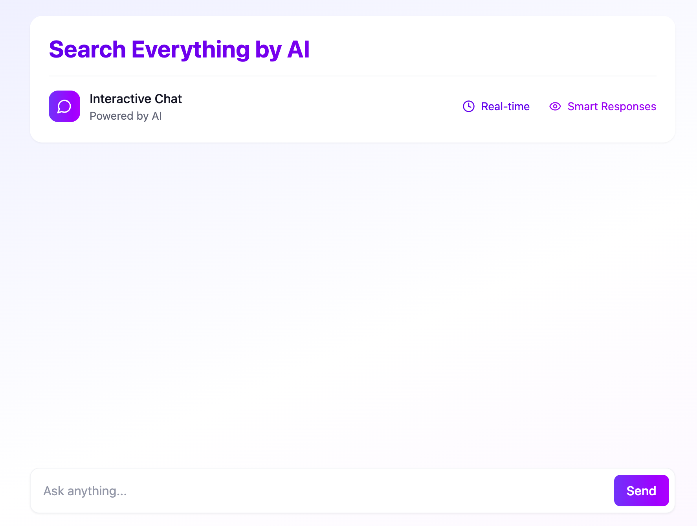

# Deepseek-Plex - AI-Powered Search Interface

A Perplexity AI-inspired search interface powered by Next.js 14 and Deepseek-R1, the new cost-efficient reasoning model rivaling GPT-4 capabilities.

## Key Features ✨

- **AI-Powered Answers** - Real-time search augmented with Deepseek-R1's advanced reasoning
- **Citation Tracking** - Automatic source references for factual verification
- **Multi-perspective** - Concurrent search results from multiple providers
- **Streaming UI** - Real-time response streaming with Vercel AI SDK
- **Session History** - Firebase-powered conversation history with search context
- **Optimized Costs** - 90% lower costs vs OpenAI while maintaining GPT-4 level performance

## Tech Stack 🛠️

**Core Framework**
- Next.js 14 App Router
- React Server Components
- Tailwind CSS + Shadcn UI

**AI Infrastructure**
- Deepseek-R1 Reasoning Engine
- Vercel AI SDK (Streaming)
- Alternative LLM Fallbacks (Anthropic, OpenAI)

**Backend Services**
- Firebase Authentication
- Firestore Database
- Deepgram Audio Processing